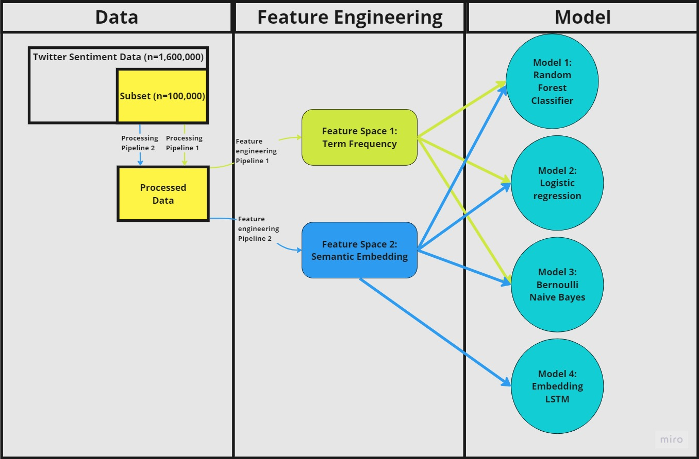

# twitter_sentiment_analysis

## Description
\
  **Project**: Columbia IEOR4525 - Multimodel NLP Twitter Sentiment Analysis
  **Contributors**: Ding, Xu (Mike); Lin, Ruoyu; Yu, Kexuan (Skylar); Zhu, Zhengyi.

  

    
  

  \
  \
  This is a project repository for 2023 Columbia Engineering IEOR4525 Machine Learning for FE and OR, Group I.
  By the time this is written down in Apr. 2023, the group implemented 4 different ML/DL models on two different
  feature spaces constructed on the dataset. 

## Data
\
  The data, not maintained in this repository, is downloaded from Kaggle: [training.1600000.processed.noemoticon.csv](https://www.kaggle.com/code/paoloripamonti/twitter-sentiment-analysis/input). Refer to Kaggle website for the data description. Note that while the original dataset is of size $n=1,600,000$, this study is done using a subset of size $n'=100,000$ due to hardware and time constraints.

## Main Files 
- Preprocessing
    - `preprocessing.py`: file contains all function used in the preprocessing pipeline. Most functions, with the exception of `str_datetime` and `cleaning` that are dataset-specific, have signature `str` -> `str` and are string processors. One aggregate function worth noticing, is `preprocess_pipeline`. Using externally fetched pipeline design, it constructs a str processing pipeline and passes ad string through it. 
- Feature Engineering
    - `feature_engineering.py`: file contains all functions used in generating features from cleaned tweet string. Two feature spaces are constructed using distict approaches: $F_1$ using term frequencies (TF-IDF) and $F_2$ using semantic embedding. All functions with the exception of `word_embedding` are used to construct $F_1$ and `word_embedding` is used to construct $F_2$. 
- Statics
    - `my_globals.py`: contains all static variables used in development.
- Notebooks
    - `F1_LR_CV.ipynb`: Logistic Regression on feature space 1, cross-validated. 
    - `F1_NB_CV.ipynb`: Bernoulli Naive Bayes classifier on feature space 1, cross-validated.
    - `F1_RF_CV.ipynb`: Random Forest classifier on feature space 1, cross-validated.
    - `F2_CV.ipynb`: Logistic Regression, Bernoulli Naive Bayes classifier, Random Forest classifier on feature space 2, cross-validated.
    - `F2_LSTM.ipynb`: LSTM model with embedding layer constructed using the same sematic embedding model as feature space 2, but without the aggregate function at the end.
